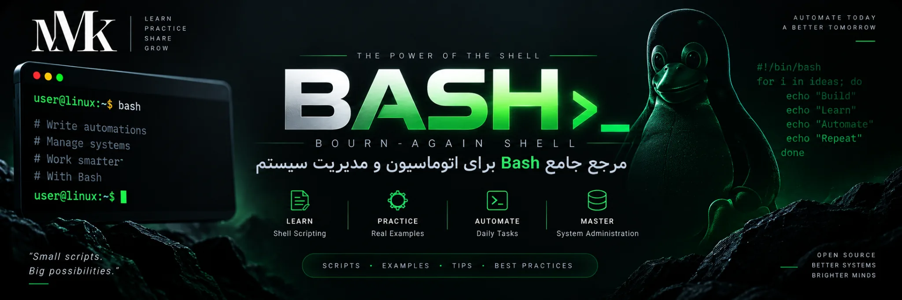

# Bash Professional Reference — English Edition

This repository turns the supplied Bash source articles into a maintainable professional reference covering shell fundamentals, filesystem work, pipelines, text processing, scripting, automation, system administration, DevOps, defensive security, debugging, portability, and shell comparison.

**Start reading:** [docs/en/index.md](docs/en/index.md)

Repeated placeholder material is excluded. Bash-specific edge cases are cross-checked against the official GNU Bash documentation.

Documentation license: [CC BY 4.0](https://creativecommons.org/licenses/by/4.0/)
